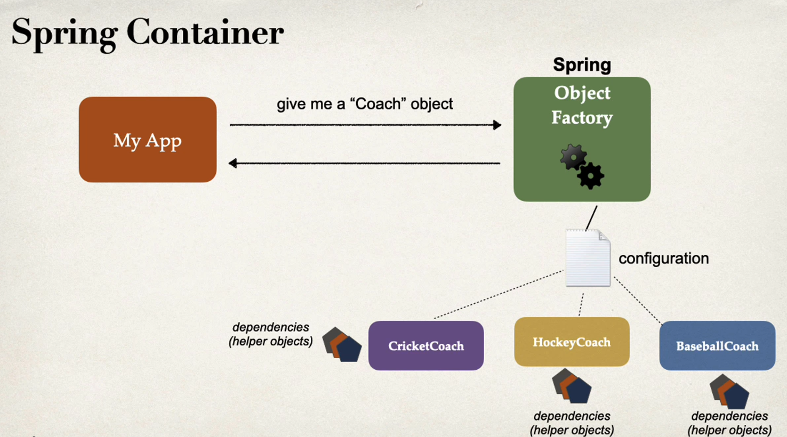
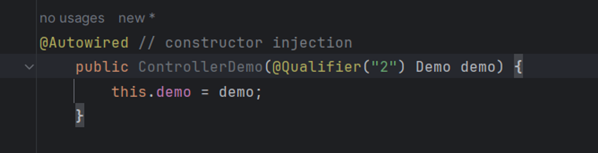
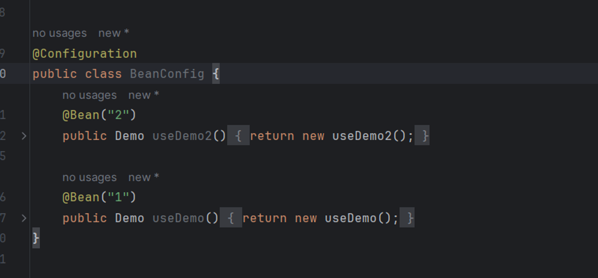
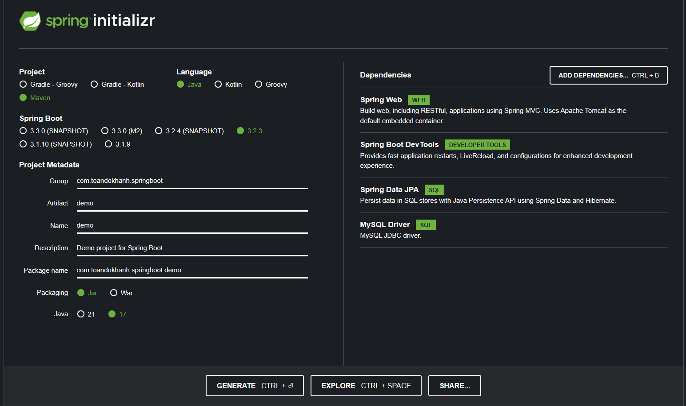

# Spring Core

### Inversion of control (IoC)
- Khái niệm IoC là cách tiếp cận trong lập trình, nơi việc xây dựng và quản lý đối tượng được "outsourcing" hoặc "đảo ngược" cho một đơn vị khác.

- IOC là một nguyên lý thường được sử dụng với Denpendency Injection (Quản lý các bean).

- IoC Container sẽ tạo ra các đối tượng, nối chúng lại với nhau, cấu hình chúng, và quản lý vòng đời của chúng từ khi tạo ra đến khi bị hủy (Bean)

- Có 2 loại IoC Container
    
    - BeanFactory
    - ApplicationContext

- VD: Một ứng dụng cần có khả năng cấu hình để dễ dàng thay đổi loại HLV thể thao mà nó sử dụng, chẳng hạn như CricketCoach, BaseballCoach, HockeyCoach, v.v.

- Giải pháp: 
    + Sử dụng một Spring container để quản lý việc tạo và quản lý các đối tượng.
    + Đối tượng container sẽ được yêu cầu tạo đối tượng HLV dựa trên cấu hình và trả lại một tham chiếu đến đối tượng đó.
- Spring Container:
    + Spring container hoạt động như một đối tượng nhà máy, sử dụng IoC.
    + Container thực hiện hai chức năng chính: tạo và quản lý các đối tượng (IoC) và tiêm các phụ thuộc của đối tượng (dependency injection).
    

- Cách cấu hình Spring Container:
    + Có ba phương pháp chính: XML configuration (đã lỗi thời), Java annotations và Java source code.
    + Tập trung vào các giải pháp hiện đại như Java annotations và Java source code.

- Spring Auto Wiring:
    + Auto wiring là cách Spring tự động tìm và inject dependency dựa trên kiểu hoặc giao diện.
    + Spring có thể tự động inject các class được đánh dấu bằng @Component và đáp ứng kiểu hoặc giao diện mong muốn.

### Dependency Injection (DI)
- @Autowired  @Component => chỉ định bean
- @Configuration  @Bean ⇒ đây là cách sử dụng bean mới nhất của spring (add thẳng vào object) thay vì cách add bằng XML thông thường
- @Qualifiers @Primary ⇒ khi có nhiều bean implement đến 1 interface thì code sẽ báo lỗi sung đột vì thế chúng ta sử dụng @Qualifiers(”beanName”) hoặc sử dụng @Primary (Lưu ý @Qualifiers có độ ưu tiên cao hơn @Primary). 
    

- @Lazy ⇒ tạo 1 lần nhiều bean nhưng cách này kh khuyến khích
- Config Bean với @Configuration và @Bean("id") 

    

### Component Scanning
- Component Scanning là một cơ chế Spring cho phép tự động tìm kiếm và đăng ký các bean trong container dựa trên các quy tắc xác định. Thay vì phải cấu hình mỗi bean một cách rõ ràng trong file cấu hình XML hoặc thông qua các annotation, có thể chỉ định cho Spring quét một gói hoặc một tập hợp các gói để tìm các bean, và Spring sẽ tự động tạo và đăng ký chúng.
- @ComponentScan
### Scope (XML & annotation)
- Scope xác định vùng phạm vi hoạt động của một bean trong container Spring. Nó quyết định liệu một bean sẽ là duy nhất trong toàn bộ ứng dụng hay mỗi lần gọi một bean mới sẽ được tạo.

- XML Configuration: Trong cấu hình XML, sử dụng các thẻ "\<bean>" để xác định scope bằng cách sử dụng thuộc tính scope.

- Annotation Configuration: Trong cấu hình dựa trên annotation, sử dụng các annotation như @Scope để chỉ định scope của một bean.
### Lifecycles (XML & annotation)
- Lifecycles trong Spring đề cập đến các sự kiện xảy ra với một bean trong quá trình nó tồn tại trong container, từ việc khởi tạo cho đến khi nó bị hủy.

- XML Configuration: Trong cấu hình XML, sử dụng các callback interfaces như InitializingBean và DisposableBean, cũng như các callback methods để xử lý các sự kiện trước và sau khi bean được tạo và hủy.

- Annotation Configuration: Trong cấu hình dựa trên annotation, sử dụng các annotation như @PostConstruct và @PreDestroy để chỉ định các phương thức sẽ được gọi tự động khi bean được tạo và hủy.

### Start a Spring Boot application

