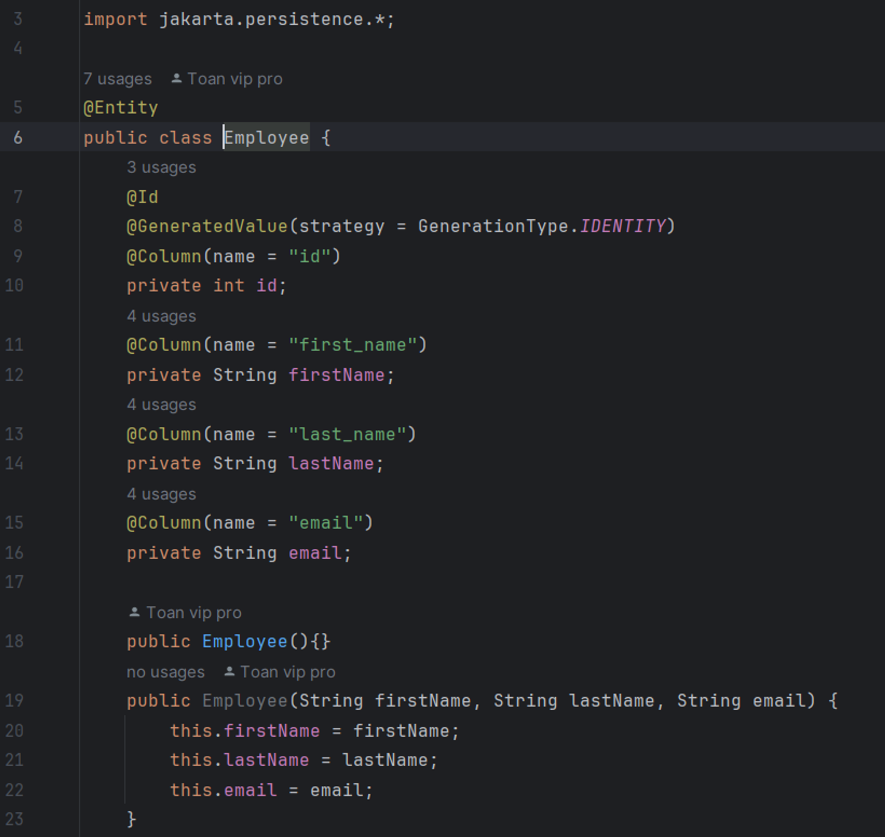

# Spring Boot Hibernate JPA

### Create a Employee Entity

### Annotation

    @Entity

    @Id

    @Column(name = "id")

    @GeneratedValue(strategy = GenerationType.IDENTITY)

    @Transactional

    @Repository

### Create a Query 

    TypedQuery<Student> theQuery = entityManager.createQuery("FROM Student", Student.class);

### Set query parameters

    theQuery.setParameter("theData", theLastName);

### ...
### ...
### ...