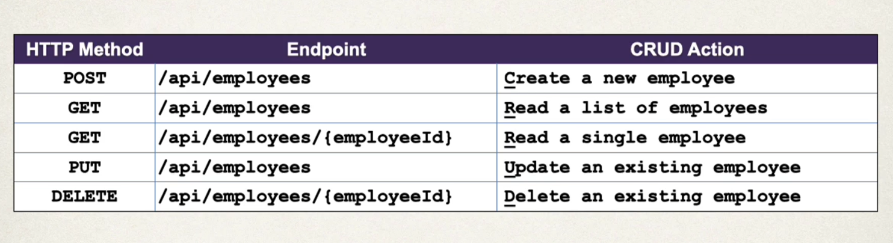
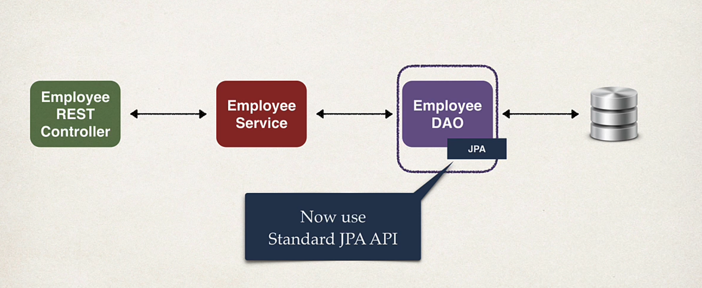
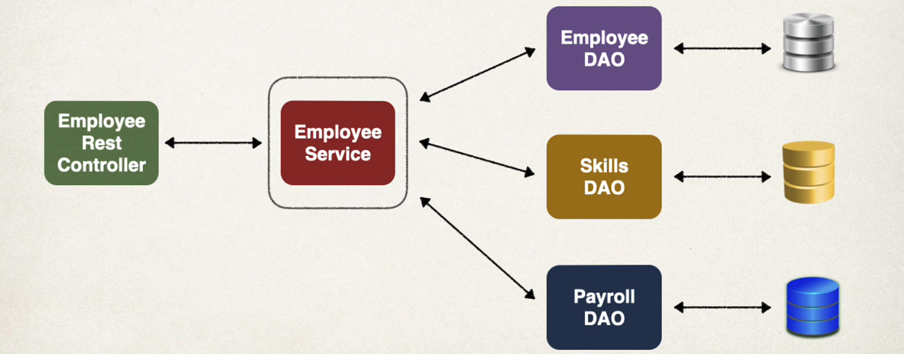
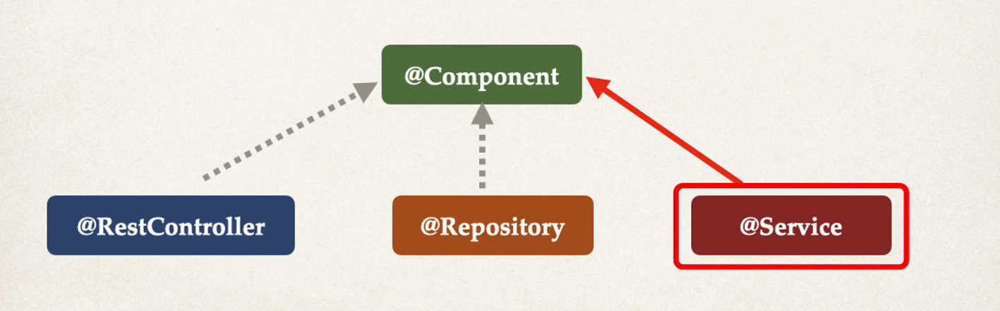
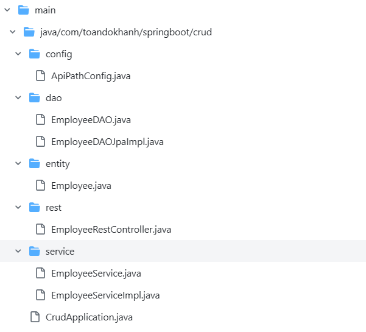
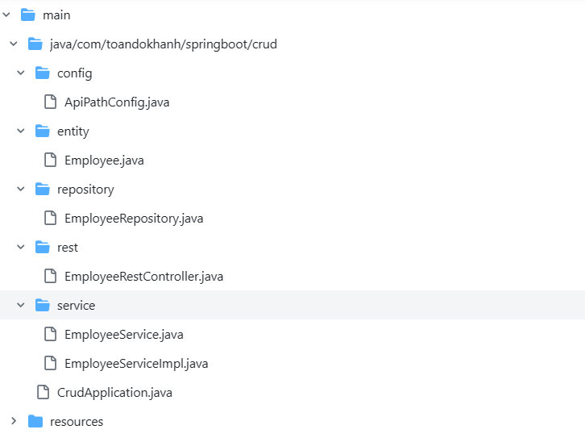
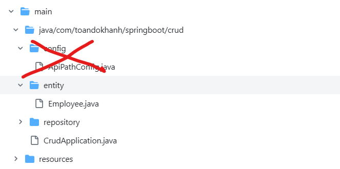

# Rest API

### Rest API design

### Rest - Service - DAO

### Service 

### Directory structure 
- DAO: before using Spring data JPA
    
    Details: https://github.com/toandokhanh/spring-boot-3-training/tree/19d4144ccf71400caed60f63c5ce5961a9688b9a/04%20Restfull%20API/crud

- JPA: after using Spring data JPA
    
    Details: https://github.com/toandokhanh/spring-boot-3-training/tree/15009691391bdebb3f11c81d1cd3559ca5b1e479/04%20Restfull%20API/crud-spring-data-jpa

- RestfulAPI based on spring-data-rest
    
    Details: https://github.com/toandokhanh/spring-boot-3-training/tree/b8a0aaff119f91f7f808637c218e6ddcdeb0e16f/04%20Restfull%20API/crud-spring-data-jpa-srping-data-rest

### ...
### ...
### ...