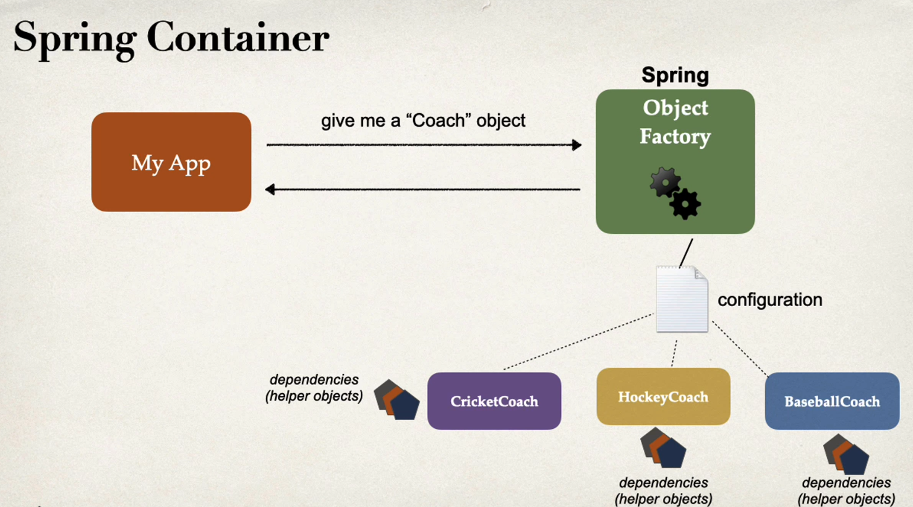
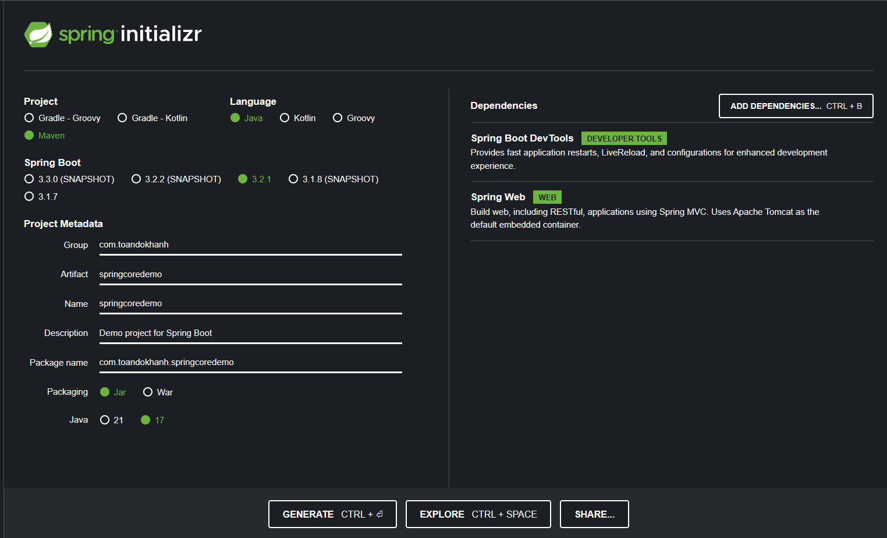

# Spring-core

### Inversion of control (IoC)
- Khái niệm IoC là cách tiếp cận trong lập trình, nơi việc xây dựng và quản lý đối tượng được "outsourcing" hoặc "đảo ngược" cho một đơn vị khác.

- VD: Một ứng dụng cần có khả năng cấu hình để dễ dàng thay đổi loại HLV thể thao mà nó sử dụng, chẳng hạn như CricketCoach, BaseballCoach, HockeyCoach, v.v.

- Giải pháp: 
    + Sử dụng một Spring container để quản lý việc tạo và quản lý các đối tượng.
    + Đối tượng container sẽ được yêu cầu tạo đối tượng HLV dựa trên cấu hình và trả lại một tham chiếu đến đối tượng đó.
- Spring Container:
    + Spring container hoạt động như một đối tượng nhà máy, sử dụng IoC.
    + Container thực hiện hai chức năng chính: tạo và quản lý các đối tượng (IoC) và tiêm các phụ thuộc của đối tượng (dependency injection).
    

- Cách cấu hình Spring Container:
    + Có ba phương pháp chính: XML configuration (đã lỗi thời), Java annotations và Java source code.
    + Tập trung vào các giải pháp hiện đại như Java annotations và Java source code.

- Spring Auto Wiring:
    + Auto wiring là cách Spring tự động tìm và inject dependency dựa trên kiểu hoặc giao diện.
    + Spring có thể tự động inject các class được đánh dấu bằng @Component và đáp ứng kiểu hoặc giao diện mong muốn.

- Demo
